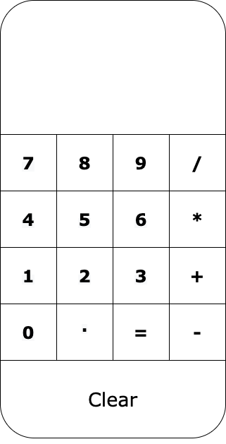
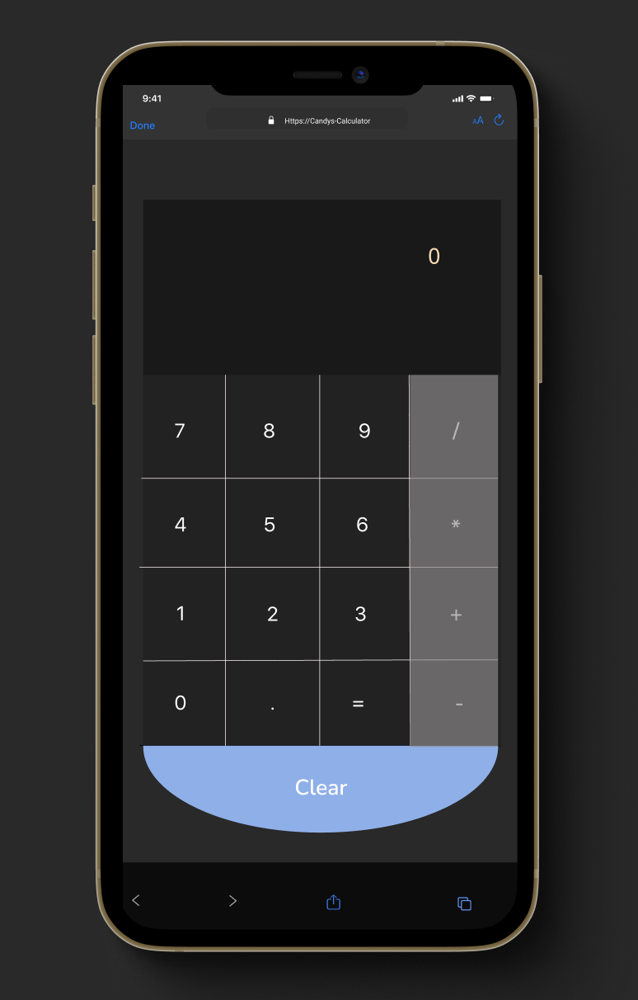
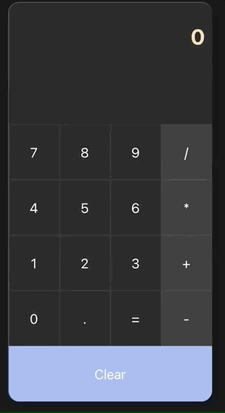

# React Calculator

### Using reactjs i've built a calculator showcasing the library's capabilities.

*Ongoing things to include*
- Recognizing positive and negative integers
- Adding a comma to seperate thousands and a full stop for place formatting

## Project Development
 >*low fidelity wireframe*

---

> Breaking down the project components that I believed I would need, I created a mock-up.
This has been broken into 4 components:
1. The display component
2. The display's styling file
3. The button component
4. The button styling file

---

>*High fidelity mockup*

---
>*React Calculator Demo*

